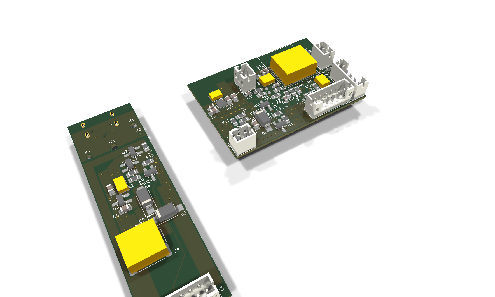
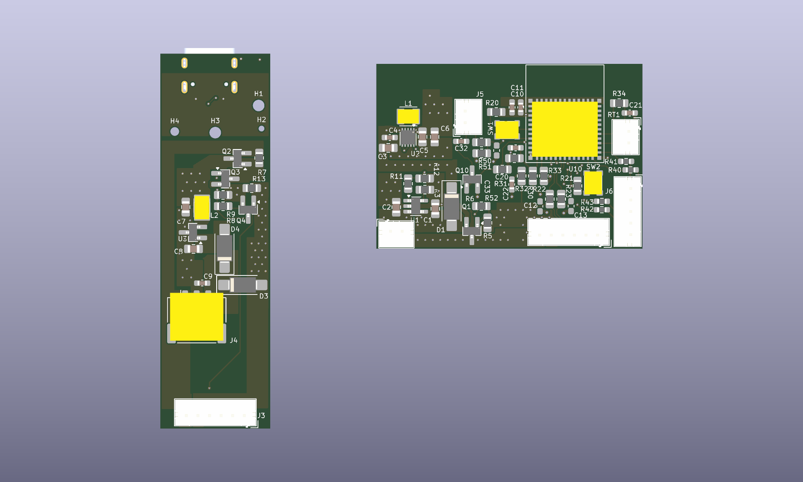
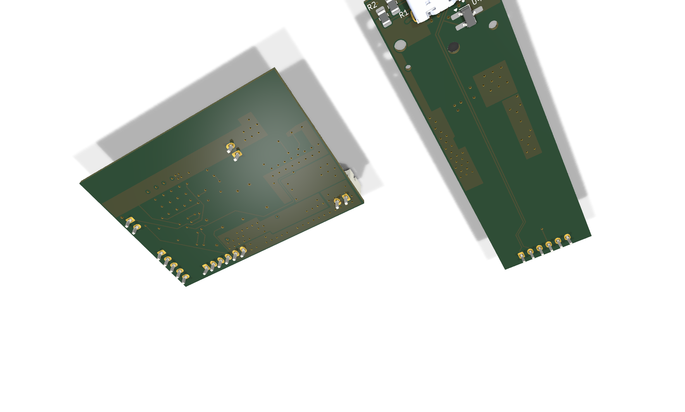
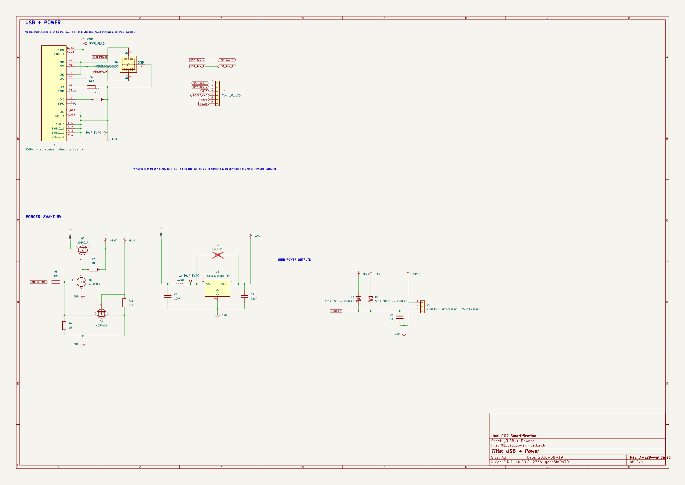
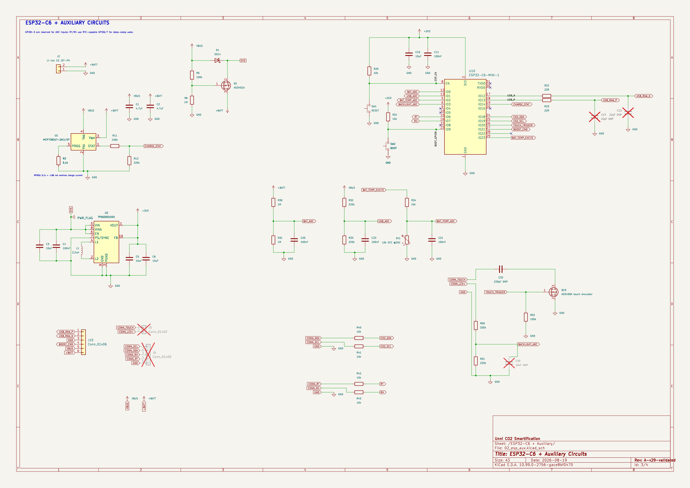

# Unni CO2 Smartification — ESP32-C6 Rev A

Target: **KiCad 10.99 nightly or newer**. The current manufacturing master uses a 4-layer stackup and native KiCad 10.99 geometric constraints.

This repository contains two physical PCBs in one KiCad PCB file so cross-board connectivity remains visible while routing. Placement and routing are still work in progress; the schematic and power architecture are substantially defined and covered by reproducible connectivity/SPICE checks.


## Hardware overview

The images below are generated directly from the current KiCad project with `kicad-cli`; they are not hand-maintained screenshots. The two physical boards intentionally remain in one PCB file during design so their interconnect nets can be routed and validated together.

### PCB — component side



The long, narrow board on the left is the **USB / power board**. The larger board on the right is the **ESP / battery board**. The USB board carries the forced-awake 5 V power stage and the enclosure-specific USB interface, while the ESP board carries the charger, 3.3 V supply, ESP32-C6 and the sensor/control interfaces.

For placement and routing inspection, the orthographic top view is also useful:



### PCB — back side



The USB-C receptacle is deliberately a **back-side component** because the mechanical measurements describe the rear side of the original enclosure. Only the measured 19 x 18 mm rear clearance area may contain back-side components; the rest of that board lies against the enclosure. A footprint without an installed 3D model will naturally not appear in these renders even though its pads and board placement are present in KiCad.

### Schematics

#### USB, forced-awake boost and Unni power interface



#### ESP32-C6, charger, 3.3 V regulator and auxiliary interfaces



The simulation harness is intentionally not shown here because it is not part of the manufactured hardware. Its generated image remains available at `docs/images/schematic/simulation-harness.png` for debugging.

### Power sequencing and source handover

There are two independent questions in the power architecture: **how the ESP stays alive**, and **whether the Unni is being fed 5 V so that it behaves as USB-powered rather than entering its battery energy-save mode**.

**1. USB disconnected, normal battery operation.** The protected 1S Li-ion feeds `+BATT`. The discrete load-share path connects the battery to `SYS`, and the TPS63031 generates the regulated `+3V3` rail for the ESP32-C6. The Unni can continue to run from its own battery/DC input without needing the ESP-generated 5 V path. This is the low-power baseline state.

**2. ESP requests forced-awake operation while USB is absent.** Once the ESP is alive from `+3V3`, it may assert `BOOST_CMD`. The hardware-enable network then allows the TPS613222A 5 V boost stage on the USB/power board to run from `+BATT`. Its `+5V` output reaches `UNNI_AC` through the output Schottky diode. Electrically, the Unni now sees the same AC/VBUS-style 5 V condition it would see from USB, so firmware can deliberately pull the Unni out of its battery energy-save behavior.

**3. Real USB is plugged in.** `VBUS` immediately supplies `SYS` through the Schottky/load-share path, so the TPS63031 and ESP are powered from USB rather than discharging the cell. In parallel, the MCP73831 charges `+BATT` at the resistor-programmed current, and the ESP can observe `CHARGE_STAT` as well as the filtered `USB_ADC` divider. USB VBUS also feeds `UNNI_AC` directly through its own Schottky path.

**4. USB always wins over the battery-generated 5 V path.** The forced-awake boost has a hardware VBUS inhibit. When real `VBUS` is present, the MOSFET inhibit network prevents the TPS613222A path from being enabled even if firmware leaves `BOOST_CMD` asserted or crashes in the wrong state. The two 5 V sources therefore do not intentionally drive each other. The output diodes provide the final source isolation at `UNNI_AC`.

**5. USB is removed again.** The charger stops, the battery load-share path retakes `SYS`, and the TPS63031 keeps the ESP on `+3V3` across the source transition. The forced-awake 5 V rail remains off unless firmware explicitly requests it after USB has disappeared. This separation is important: keeping the ESP alive does not automatically force the Unni into its higher-power USB mode.

The practical state table is therefore:

| External USB | `BOOST_CMD` | ESP source | Unni `UNNI_AC` | Result |
| --- | --- | --- | --- | --- |
| absent | 0 | battery -> `SYS` -> TPS63031 | no ESP-generated 5 V | normal battery / energy-save capable |
| absent | 1 | battery -> `SYS` -> TPS63031 | TPS613222A -> `+5V` -> diode | forced-awake / USB-like Unni power state |
| present | 0 | VBUS -> `SYS` -> TPS63031 | VBUS -> diode | USB-powered; battery charging |
| present | 1 | VBUS -> `SYS` -> TPS63031 | VBUS -> diode; boost hardware-inhibited | same safe USB-powered state |

The ADC paths (`BAT_ADC`, `USB_ADC`, `BACKLIGHT_ADC`) and `CHARGE_STAT` let firmware distinguish these power states without making the safety-critical source arbitration depend on software alone.

### Re-generating the README images

With a KiCad 10.99 nightly `kicad-cli` on `PATH`, run:

```sh
./tools/render_readme_assets.sh
```

Or point it at a specific build:

```sh
KICAD_CLI=/path/to/kicad-cli ./tools/render_readme_assets.sh
```

This refreshes all PCB renders and schematic PNGs under `docs/images/`.

## Physical boards

- **USB / power board** — 19 mm fixed width, 1.0 mm finished-board target, USB-C on B.Cu at the measured enclosure datum. It contains USB-C/CC, the TPD2E009DBZR USB ESD shunt, the battery-driven 5 V forced-awake boost and the Unni AC/DC interface.
- **ESP / battery board** — maximum 46 x 32 mm. It contains the ESP32-C6-MINI-1, MCP73831 charger and USB/battery load sharing, TPS63031 3.3 V buck-boost, battery/USB/backlight ADCs, battery NTC, CO2/RT/RH taps, touch emulation, and local service controls.

The boards currently use JST-PH connectors where serviceability is useful. If enclosure clearance proves too tight, their exposed through-hole/SMT pads are also suitable for direct wire soldering; this is an assembly fallback, not a separate electrical architecture.

## Power architecture

```text
USB VBUS ──────────────┬─ MCP73831 (≈196 mA, RPROG=5.1k) ── +BATT
                       ├─ Schottky ── SYS ── TPS63031 ── +3V3 ── ESP32-C6
                       └─ Schottky ─────────────────────── UNNI_AC

protected 1S Li-ion ─ +BATT ─ PMOS load share ─────────── SYS
                    └ +BATT ─ boost switch ─ TPS613222A ─ +5V ─ Schottky ─ UNNI_AC
```

Hardware VBUS inhibit prevents the battery 5 V boost from being enabled while real USB power is present. The battery pack used by the design contains its own protection PCB.

## USB

- USB-C sink: independent 5.1 kΩ Rd on CC1 and CC2.
- Native ESP32-C6 USB Full-Speed is routed through 22 Ω series resistors near the ESP.
- USB ESD: **TI TPD2E009DBZR**, a two-line ground-referenced shunt device with no VBUS/VCC rail. This avoids a clamp path that could back-power VBUS and interfere with the hardware boost inhibit.
- `USB_ADC` includes local RC filtering.
- USB differential geometry is intentionally **not final yet**. Route it only after the selected PCBWay stackup is loaded; final impedance geometry should be checked against PCBWay's impedance/stackup data if controlled impedance is ordered.

## 4-layer PCBWay stackup

The KiCad stackup now models PCBWay's published regular 4-layer **1.0 mm / 1 oz outer / 1 oz inner** construction (70% inner-layer residual-copper variant):

| Layer | KiCad model |
| --- | --- |
| F.Cu | 0.035 mm finished Cu (1 oz) |
| dielectric 1 | 0.1855 mm 7628 RC46% prepreg, εr 4.74 |
| In1.Cu | 0.035 mm Cu (1 oz) |
| core | 0.430 mm FR-4, εr 4.6 |
| In2.Cu | 0.035 mm Cu (1 oz) |
| dielectric 3 | 0.1855 mm 7628 RC46% prepreg, εr 4.74 |
| B.Cu | 0.035 mm finished Cu (1 oz) |

PCBWay publishes this as a nominal 1.0 mm four-layer construction; the finished board remains subject to normal fabrication tolerance. Soldermask is modeled only approximately in KiCad. If controlled impedance is ordered, use PCBWay's confirmed production stackup/impedance data rather than treating the KiCad material model as a fabrication guarantee.

Both internal layers are intended to remain GND reference planes. Power distribution uses F.Cu/B.Cu pours and stitching vias. High-dv/dt switch nodes remain small local outer-layer copper only. The ESP module antenna has an all-copper-layer keepout.

Current PCBWay references:
- https://www.pcbway.com/multi-layer-laminated-structure.html
- https://www.pcbway.com/capabilities.html
- https://www.pcbway.com/helpcenter/ordering_parameter_instruction/What_is_the_PCB_Copper_Weight_.html

## Schematic sheets

- `01_usb_power.kicad_sch` — USB-C/CC, TPD2E009DBZR ESD, forced-awake 5 V boost, hardware USB inhibit, Unni AC/DC interface.
- `02_esp_aux.kicad_sch` — protected-battery input, MCP73831 charger, discrete USB/battery load share, TPS63031 3.3 V rail, ESP32-C6, ADC sensing, NTC, passive CO2/RT/RH taps, touch emulation and controls.
- `03_simulation_harness.kicad_sch` — simulation-only stimuli and loads; excluded from BOM/PCB.

## Routing / fabrication baseline

The Board Setup intentionally targets comfortable low-cost PCBWay geometry rather than absolute fab limits:

- general minimum trace width / copper clearance: 0.15 mm
- routed-edge copper clearance: 0.25 mm
- hole-to-copper baseline: 0.20 mm
- via-hole-to-via-hole baseline: 0.30 mm
- drilled component pad hole-to-hole: 0.45 mm via `.kicad_dru`
- minimum annular ring: 0.15 mm
- normal preferred via: 0.60/0.30 mm
- larger power via preset: 0.80/0.40 mm
- zones: 0.25 mm nominal clearance, 0.20 mm hard floor, 0.30 mm thermal gap, 0.40 mm thermal spokes

Preferred netclass widths remain wider than the hard manufacturing minimum. Fine-pitch IC pad escapes may neck down briefly before returning to their preferred class width.

## Simulation and validation

Open `unni-smartification-c6.kicad_pro`, then **Inspect -> Simulator**. `unni-smartification-c6.wbk` contains transient views. See `SIMULATION.md` for model fidelity and test details.

A normal macOS validation run is:

```sh
KICAD_CLI="/Applications/KiCad/KiCad.app/Contents/MacOS/kicad-cli" ./tools/validate_all.sh
```

If KiCad's ngspice shared library is not auto-discovered, set `NGSPICE_LIB` explicitly. Validation checks:

1. fixed mechanics and both board envelopes;
2. PCBWay stackup and routing-rule presets;
3. schematic load, PDF and KiCad/XML/SPICE netlist export;
4. schematic↔PCB pad/net parity;
5. critical power/USB connectivity, the TPD2E009 pinout, RPROG=5.1 kΩ and USB_ADC filtering;
6. ERC classification;
7. standalone behavioral power regressions;
8. a transient generated directly from KiCad's exported SPICE netlist;
9. a 12-case battery/internal-resistance worst-case sweep.

Behavioral models validate topology, source handover, charger behavior, enable/inhibit states and supply transients. They do **not** predict switch-node ripple, converter control-loop stability, switching loss, RF performance or EMI.

After opening a revision in PCB Editor, **refill all zones (`B`) before trusting DRC**, especially after changes to hole-clearance or stackup rules. KiCad stores filled-zone geometry in the PCB file; cached fills from the previous rule set can otherwise report obsolete clearances until refilled.

## Mechanical reference

See `MECHANICAL.md`. The measured USB-board top datum, hole locations and USB overhang are fixed; the board may extend only toward its rear/bottom direction. The USB-side B.Cu component-clearance window is limited to the first 19 x 18 mm, with an explicit placement keepout below it.


## PCB sheet placement

Both physical PCB islands are kept in the same A4 PCB drawing sheet, but the complete layout is translated into the lower-left half so neither board outline crosses the sheet boundary. The USB/power board top-left datum is currently at `(72.65, 123.2)` mm; the ESP/interface board spans `(110, 125)` to `(156, 157)` mm. This translation is purely a drawing-sheet placement change: all copper, footprints, zones, dimensions, generated via-stitch regions and native 10.99 geometric constraints retain their relative geometry. `tools/validate_mechanics.py` verifies both board envelopes and A4 containment.

## KiCad 10.0.5 compatibility export

The editable project master targets KiCad 10.99 because it uses native geometric PCB constraints and generated via-stitch metadata. Some fabrication/export plugins are only available for stable KiCad 10.0.5, so the repository includes a reproducible compatibility converter instead of downgrading the master.

Create the stable compatibility tree with:

```sh
python3 tools/make_kicad_10_0_5_copy.py
```

The result is written to `dist/kicad-10.0.5/unni-smartification-c6/`. Use that copy for KiCad 10.0.5 plugins and final fabrication exports. Do not make design edits there; regenerate it from the 10.99 master after each relevant change.

For a real KiCad 10.0.5 smoke test (schematic parse/ERC/netlist plus PCB DRC/schematic parity/Gerber/drill export):

```sh
KICAD_10_0_5_CLI=/path/to/kicad-cli tools/validate_kicad_10_0_5_export.sh
```

The converter removes only 10.99 editing/link metadata that stable 10.0.x cannot safely consume: native geometric constraint objects, generated via-stitch descriptors and design-block `lib_id` links attached to instantiated groups. The group members themselves remain local in the schematic/PCB, already-instantiated vias remain explicit PCB vias, footprint placements are translated to the 10.0.x representation, and the mechanical geometry continues to be guarded by `tools/validate_mechanics.py` in the master project.

## Per-board PCBWay Gerber export

The design intentionally keeps both physical boards in one `.kicad_pcb`, while fabrication requires one closed board outline per order. Generate separate PCBWay upload packages with:

```sh
KICAD_10_0_X_CLI=/path/to/KiCad-10.0.x/kicad-cli \
  python3 tools/export_pcbway_gerbers.py
```

The script creates a temporary stable-KiCad compatibility copy, identifies the 19 mm USB/power island and the 46 x 32 mm ESP/interface island from `Edge.Cuts`, then exports each board independently. Outputs are written to `dist/pcbway/`:

- `unni-usb-power-pcbway-gerbers.zip`
- `unni-esp-interface-pcbway-gerbers.zip`

Each ZIP contains four copper layers, front/back solder mask, front/back silkscreen, `Edge.Cuts`, Gerber job data and separate PTH/NPTH Excellon drill files. The Gerbers are emitted as classic RS-274-X with X2/netlist attributes disabled and Protel-style layer extensions for maximum PCBWay compatibility. Paste layers are intentionally omitted from bare-PCB fabrication packages.

Recommended PCBWay order parameters for this revision: **FR-4, 4 layers, 1.0 mm board thickness, 1 oz finished outer copper, 1 oz inner copper**. Regenerate the ZIPs after every PCB change.
